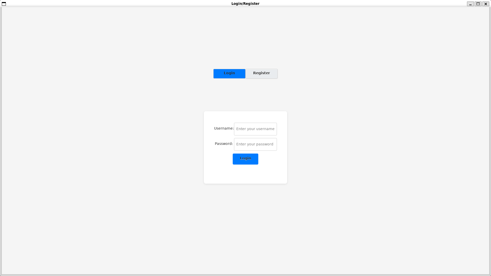
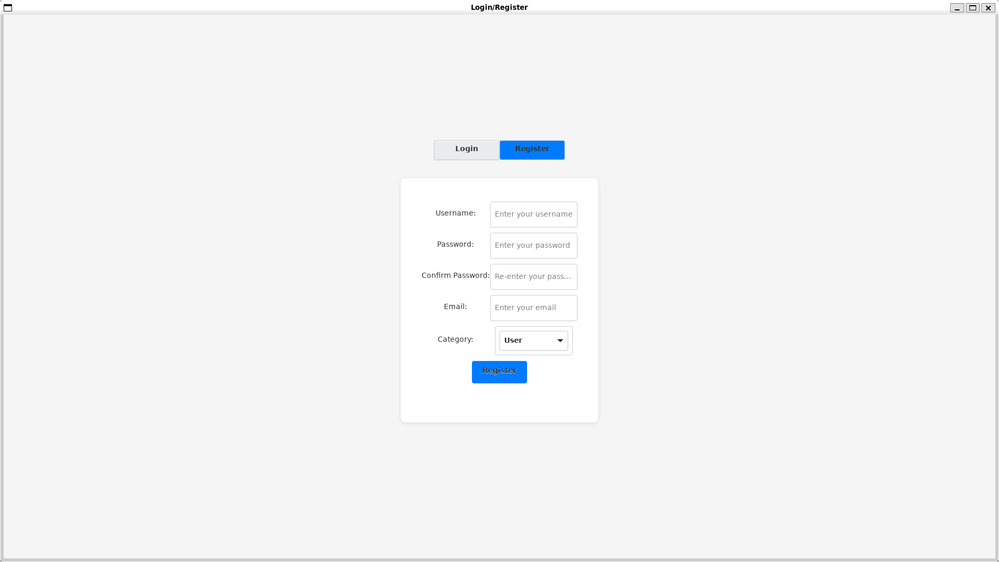

# GTK Login/Register Application

A modern, user-friendly login and registration system built with C and GTK3. This project demonstrates best practices for GTK3 UI design, modular C code, and user credential management.

## Features
- Login and registration forms with validation
- User credentials stored in a local file
- Customizable UI with CSS styling
- Category selection (User/Admin)
- Professional, responsive layout

## Screenshots

### Login Page


### Register Page


## Directory Structure
- `src/` — Source code files
- `include/` — Header files
- `resources/` — CSS, icons, and images
- `build/` — Compiled binaries

## Prerequisites
Make sure GTK3 development packages are installed on your system.

### Ubuntu Installation
To install GTK3 and its development files on Ubuntu, run:
```sh
sudo apt update
sudo apt install libgtk-3-dev build-essential pkg-config
```

To verify the installation:
```sh
pkg-config --cflags gtk+-3.0
```
If the above command prints compiler flags (e.g., `-I/usr/include/gtk-3.0`), GTK3 is installed correctly.

## Build Instructions
To build the project, run:
```sh
make
```

## Run Instructions
To run the application:
```sh
make run
```

## Clean Build Files
To clean up build artifacts:
```sh
make clean
```

## License
This project is licensed under the MIT License. See the [LICENSE](LICENSE) file for details.

---

**Author:** [Your Name Here]

For any questions or contributions, please open an issue or pull request.
